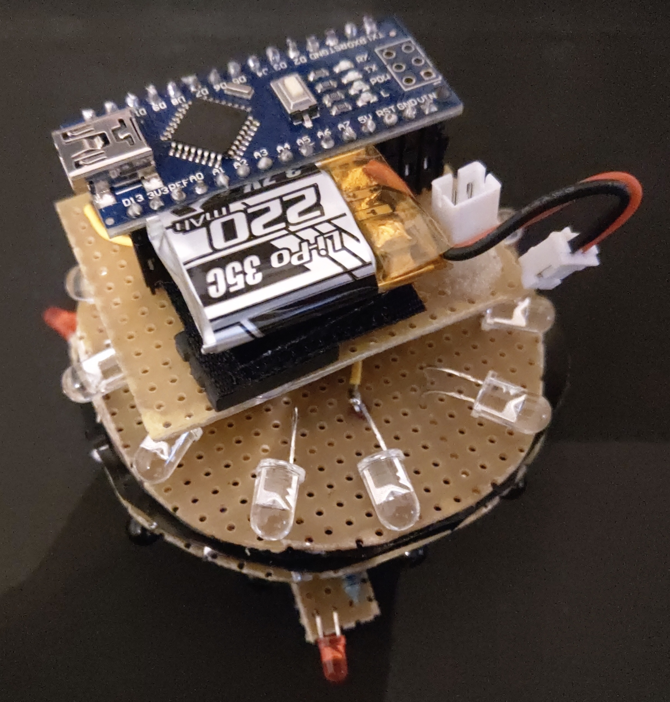
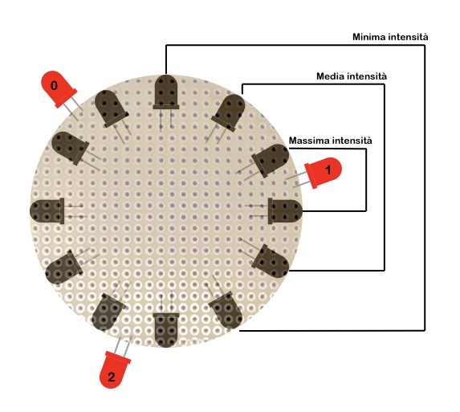

# Microbot

Microbot è un progetto per il corso di "Elettronica Generale" di Ingegneria Informatica dell'Università degli Studi di Brescia.

# Indice

* [Obiettivo](#Obiettivo)
* [Hardware](#Hardware)
* [Software](#Software)
  * [Sensori di prossimità](#Sensori-di-prossimità)
  * [Attuatori led](#Attuatori-led)
  * [Logica](#Logica)
 
# Obiettivo

Realizzare un piccolo robot in grado di vedere attorno a se grazie a sensori di prossimità infrarossi e indicare la presenza dell’oggetto attivando diodi led con luminosità crescente al avvicinarsi dell’oggetto. In questo modo si “insegue” l’oggetto evidenziando la sua posizione.
 
# Hardware

Il dispositivo hardware assemblato risulta come in foto:
 

 
La documentazione sulla progettazione del dispositivo hardware è disponibile nel documento:
[documento-hardware](https://drive.google.com/file/d/1D7-pHRRr-NHN0P8EHxNenzi6C1bxaE9S/view?usp=sharing)
 
Si riportano per comodità i collegamenti pin-componenti:
 
| Pin GPIO | Componente                 |
| -------- | -------------------------- |
| D2       | Gruppo 0 led IR Emettitori |
| D3       | Gruppo 1 led IR Emettitori |
| D4       | Gruppo 2 led IR Emettitori |
| D5       | Gruppo 3 led IR Emettitori |
| D6       | Gruppo 3 led IR Ricevitori |
| D7       | Gruppo 2 led IR Ricevitori |
| D8       | Gruppo 1 led IR Ricevitori |
| D9       | Attuatore led luminoso 0   |
| D10      | Attuatore led luminoso 1   |
| D11      | Attuatore led luminoso 2   |
| D12      | Gruppo 0 led IR Ricevitori |
| A0       | Lettura prossimità 0       |
| A1       | Lettura prossimità 1       |
| A2       | Lettura prossimità 2       |

# Software

Il software è un semplice programma Arduino in cui si sono sviluppate delle classi per la gestione dei componenti sulla scheda.
La scheda programmabile utilizzata è un Arduino Nano v.3 (ATMega328 - old bootloader).

## Sensori di prossimità

Per la gestione dei sensori di prossimità si sono sviluppate due librerie: _RadialIRLed.h_ e _RadialIRProximity.h_.

La prima è per la gestione di un anello di led IR; come si può leggere nella progettazione hardware i led IR sono divisi in quattro gruppi di tre led ciascuno. La classe _RadialIRLed_ predispone metodi per l'attivazione e lo spegnimento di un gruppo alla volta. Inoltre, lo scorrimento dei gruppi è mascherato ricordando lo stile degli Iterator di Java.
La libreria è configurata staticamente per i quattro gruppi di led IR presenti, ma facilmente riconfigurabile tramite le costanti.

La seconda libreria gestisce l'anello di sensori di prossimità. Pertanto essa necessita dei riferimenti ai pin sia per i led IR emettitori che ricevitori, oltre ai pin analogici per la lettura del dato.
La classe _RadialIRProximity_ consente di leggere il valore di ogni sensori di prossimità e restituire tali dati in un array di interi (valori tra 0 e 1023 come per _analogRead_). L'operzione di lettura consiste nell'attivare un gruppo di led IR e leggere tutti i pin analogici indicati per ottenere i dati del gruppo; si procede allo stesso modo per ciascun gruppo.
Risulta possibile effettuare la lettura per un sol gruppo ed ottenere una media per la lettura dei ricevitori senza accendere gli emettitori (valore ambientale).
La libreria è configurata staticamente per i dodici sensori di prossimità IR presenti, ma facilmente riconfigurabile tramite le costanti.

## Attuatori led luminosi

Gli attuatori led luminosi sono gestiti tramite pin PWM, pertanto si è sviluppata la libreria _PWMActuator.h_ per il mascheramento dei pin PWM su valori percentuali.
Infatti, la classe predispone di due metodi per lo spegnimento (_turnOff()_) e l'accensione (_turnOn(float)_) indicando un valore decimale tra 0 e 1 per variare la potenza da un minimo ed un massimo definito a costante all'interno della libreria. Altro valore configurabile è la tensione di alimentazione della scheda, in modo da scalare i valori percentuali sulla tensione effettivamente erogata.
 
## Logica

La logica di accensione del led luminoso 1 è schematizzata in figura, dove si hanno gli attuatori led luminosi in rosso ed i sensori di prossimità in nero:

Questo schema è replicabile per ciascun attuatore mantenendo costanti le distanze dallo stesso led luminoso.

Si hanno tre livelli di intensità per ciascun il led luminoso:

* la massima intensità si ha se almeno uno dei due sensori di prossimità più vicini rileva un oggetto;
* la media intensità si ha se almeno uno dei due sensori di prossimità adiacenti (uno per lato) rileva un oggetto;
* la minima intensità si ha se almeno uno dei due sensori di prossimità ancora più esterni per entrambi i lati rileva un oggetto.

Se nessuno dei sensori di prossimità indicati rileva un oggetto allora il led luminoso sarà spento.

Per elaborare i dati letti si ricorre alla libreria _IRProximityConverter.h_, la quale fornisce due conversioni possibili:

* 'booleana': sovrascrive i dati con il valore 1 se l'oggetto è presente, 0 altrimenti;
* 'distanza': sovrascrive i dati con un valore intero per indicare quanto distante risulta l'oggetto (ANCORA DA IMPLEMENTARE).

Per la conversione booleana si prevede un valore di tolleranza impostabile tramite costante nella libreria e il valore medio ambientale. Perchè sia rilevato un oggetto, il valore letto deve superare la somma dei due.
